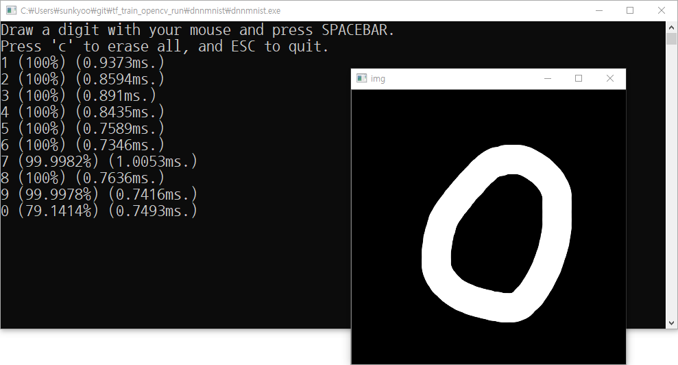

# Programming environments
* Windows 10 x64
* Visual Studio 2017 (15.9.x)
* Python 3.6 (Anaconda3 5.1.0)
* Tensorflow 1.12.0

# How to run
1. Run **python mnist_cnn.py** in a command window. **mnist_cnn.pb** file will be created.
2. Open **./dnnmnist/dnnmnist.sln** file with Visual Studio 2017
3. Build the dnnmnist solution as Release mode.
4. Copy **./dnnmnist/x64/Release/dnnmnist.exe** file to **./dnnmnist/** folder
5. Run **./dnnmnist/dnnmnist.exe**!! (dnnmnist.exe looks for mnist_cnn.pb file in the parent folder) 

# Screen shot
